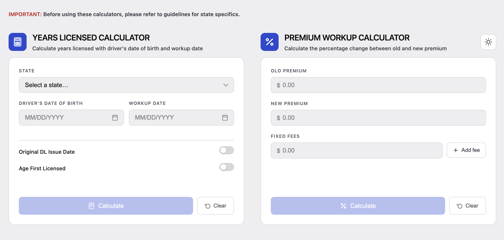

[](https://angular.dev)
[](https://typescriptlang.org)
[](https://playwright.dev)
[](https://opensource.org/licenses/MIT)

# AP Workup Tool

Insurance workup calculators for quickly checking driver experience and premium changes during underwriting or remarketing reviews.

This is a themed fork of [ap-workup-angular](https://github.com/markwaldron7string/ap-workup-angular) used to experiment with background photos, glass-card styling, and additional themes without touching the original project.



## Calculators

### Years Licensed Calculator

Calculates years licensed using the driver's date of birth, workup date (quote date), and state-specific permit/license age rules.

Supports:

- Exact calculation states: Massachusetts, North Carolina, California
- New Jersey month-bracket output
- Range output for other states
- Optional age-first-licensed override
- Optional original DL issue date override for supported states
- One-click copy button on each result card

### Premium Workup Calculator

Calculates percentage change between old and new premium values.

Supports:

- Premium increase, decrease, and flat-change output
- Fixed fee exclusions
- Clear/reset behavior
- One-click copy button on each result card - copies the result to the clipboard in a clean plain-text format

## Themes

A toggle in the top-right corner switches between three full-bleed photo backgrounds. Cards throughout the app use a translucent, blurred "glass" surface so the background shows through, and the choice persists in `localStorage` across visits.

| Theme | Icon | Background | Look |
| --- | --- | --- | --- |
| Light | Palm tree | `LightBlue.jpg` | Bright, airy, high-contrast text |
| Dark | Umbrella in the rain | `JapaneseNeon.jpg` | Moody neon night scene |
| Dusk | Ocean horizon | `StoneBeach.jpg` | Warm sunset over a rocky shoreline |

Result cards (success / warn / danger) are tuned per theme so the increase, decrease, and no-change states stay legible against each background image.

## Tech Stack

- Angular 21
- TypeScript
- pnpm
- Vitest
- jsdom
- Playwright
- GitHub Actions

## Getting Started

Install dependencies:

```bash
pnpm install
```

Start the local development server:

```bash
pnpm start
```

Then open:

```text
http://localhost:4200/
```

## Available Scripts

Run the app locally:

```bash
pnpm start
```

Build for production:

```bash
pnpm build
```

Run unit tests in watch mode:

```bash
pnpm test
```

Run unit tests once for CI:

```bash
pnpm test:ci
```

Run end-to-end tests (requires the dev server running at `http://localhost:4200`):

```bash
pnpm test:e2e
```

Run end-to-end tests in interactive UI mode:

```bash
pnpm test:e2e:ui
```

## Testing

Unit tests are written with Vitest through Angular's unit test builder. Coverage includes:

- Rendering both calculator headings
- State age-rule lookups against the AP guideline table, including permit/license edge cases
- Masked date-input typing, backspace/delete, and cursor-position behavior
- Years-licensed clipboard text for range, exact, and New Jersey month-bracket results
- Premium calculator readiness, fee handling, clipboard text, and clear/reset behavior

The unit spec lives beside the code it tests:

```text
src/app/app.spec.ts
```

End-to-end tests are written with Playwright and drive a real browser against the running app. Coverage includes:

- Years Licensed and Premium Workup calculator happy paths and edge cases
- State-by-state permit/license eligibility scenarios (TX, MA, NJ, NC, CA, MT, PA, VA, AK, DE, MD, and more)
- Theme toggle behavior across light, dark, and dusk

Spec files:

```text
e2e/ap-workup.spec.ts
e2e/deep-verify.spec.ts
```

## Continuous Integration

The `.github/workflows/ci.yml` workflow (inherited from the upstream project) runs on pushes and pull requests to `main`:

1. Installs dependencies with pnpm
2. Runs `pnpm test:ci`
3. Runs `pnpm build`
4. Installs Playwright's Chromium browser
5. Starts the app and runs `pnpm test:e2e` against it
# ap-workup-themes
